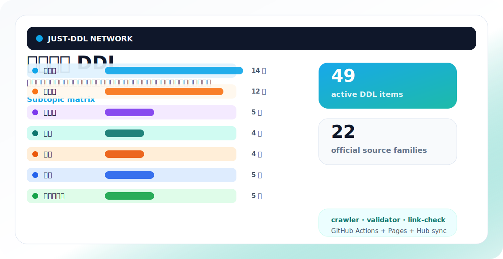
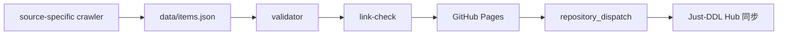

<p align="center">
  
</p>

<h1 align="center">体育赛事 DDL</h1>

<p align="center">
  乒乓球、羽毛球、篮球、足球、台球、匹克球、路跑与田径的赛事倒计时和官方来源追踪。<br>
  给体育爱好者、参赛者、俱乐部运营和内容编辑使用：先看下一场，再追官方来源。
</p>

<p align="center">
  <a href="https://just-agent.github.io/sports-ddl/"></a>
  <a href="https://just-agent.github.io/just-ddl/#/topic/sports-ddl"></a>
  <a href="https://github.com/Just-Agent/sports-ddl/actions/workflows/update-data.yml"></a>
  
</p>

<p align="center">
  <a href="https://just-agent.github.io/sports-ddl/"><strong>打开专题站</strong></a>
  ·
  <a href="https://just-agent.github.io/just-ddl/#/topic/sports-ddl">在 Just-DDL Hub 查看</a>
  ·
  <a href="data/items.json">下载数据 JSON</a>
  ·
  <a href="data/sources.json">查看来源清单</a>
</p>

## 为什么拆成独立仓库

体育赛事 DDL 是 Just-DDL Network 的一个独立专题仓库。它单独维护数据、crawler、validator、link-check、GitHub Pages 和 Hub 同步，这样每个专题可以按自己的来源节奏更新，不会互相拖累。

> 数据仅供参考；报名、参赛、购票和投稿等关键决策请以官方页面为准。

## 专题总览

| 指标 | 当前值 |
| --- | ---: |
| DDL 条目 | 49 |
| 子专题 | 7 |
| 来源族 | 22 |
| Pages | [https://just-agent.github.io/sports-ddl/](https://just-agent.github.io/sports-ddl/) |
| Hub | [https://just-agent.github.io/just-ddl/#/topic/sports-ddl](https://just-agent.github.io/just-ddl/#/topic/sports-ddl) |

## 子专题矩阵

不同项目使用不同颜色和缩略标识，专题站卡片里也会按同一套视觉规范展示。

| 子专题 | 条目 | 视觉/内容边界 | 下一条代表节点 |
| --- | ---: | --- | --- |
|  | 14 | BWF 世界巡回赛与公开赛 | [Perodua Malaysia Masters 2026](https://bwfbadminton.com/calendar/) |
|  | 12 | ITTF / WTT 职业赛历 | [WTT Contender Lagos 2026](https://www.ittf.com/2026-events-calendar/) |
|  | 5 | PPA / MLP 巡回赛 | [Major League Pickleball Dallas 2026](https://majorleaguepickleball.co/news/major-league-pickleball-announces-full-2026-may-august-season-schedule-event-tickets-now-on-sale-via-tixr-and-ticketmaster-2/) |
|  | 4 | Pool / Snooker 赛事入口 | [UK Open Pool Championship 2026](https://matchroompool.com/uk-open-pool-championship/) |
|  | 4 | NBA Finals 与 FIBA 世界杯 | [NBA Finals 2026](https://www.nba.com/playoffs/2026/nba-finals) |
|  | 5 | FIFA / UEFA 官方赛事节点 | [FIFA World Cup 2026 Opening Match](https://www.fifa.com/en/tournaments/mens/worldcup/canadamexicousa2026/articles/match-schedule-fixtures-results-teams-stadiums) |
|  | 5 | 马拉松与 World Athletics | [World Athletics U20 Championships Oregon 2026](https://worldathletics.org/competitions/world-athletics-u20-championships) |

## 近期节点

| 类型 | 事件 | 日期窗口 | 阶段 | 来源 |
| --- | --- | --- | --- | --- |
|  | [Perodua Malaysia Masters 2026](https://bwfbadminton.com/calendar/) | May 19-24, 2026 | 开赛 | BWF Tournament Calendar |
|  | [WTT Contender Lagos 2026](https://www.ittf.com/2026-events-calendar/) | May 19-24, 2026 | 开赛 | ITTF 2026 Events Calendar |
|  | [Major League Pickleball Dallas 2026](https://majorleaguepickleball.co/news/major-league-pickleball-announces-full-2026-may-august-season-schedule-event-tickets-now-on-sale-via-tixr-and-ticketmaster-2/) | May 22-25, 2026 | 开赛 | Major League Pickleball |
|  | [KFF Singapore Badminton Open 2026](https://bwfbadminton.com/calendar/) | May 26-31, 2026 | 开赛 | BWF Tournament Calendar |
|  | [UK Open Pool Championship 2026](https://matchroompool.com/uk-open-pool-championship/) | May 26-31, 2026 | 开赛 | Matchroom Pool |
|  | [PPA Asia 500 Macao Open 2026](https://ppatour.com/schedule/) | May 27-31, 2026 | 开赛 | PPA Tour |
|  | [Indonesia Open 2026](https://bwfbadminton.com/calendar/) | Jun 2-7, 2026 | 开赛 | BWF Tournament Calendar |
|  | [NBA Finals 2026](https://www.nba.com/playoffs/2026/nba-finals) | Jun 3-19, 2026 | 决赛 | NBA Playoffs |
|  | [FIFA World Cup 2026 Opening Match](https://www.fifa.com/en/tournaments/mens/worldcup/canadamexicousa2026/articles/match-schedule-fixtures-results-teams-stadiums) | Jun 11, 2026 | 开赛 | FIFA World Cup 2026 Match Schedule |

## 数据来源

来源策略：官方/主办方优先；当官方详情页尚未开放时，允许使用权威聚合页作为临时入口，并在后续 crawler 中替换为官方详情 URL。

| 来源 | Adapter | 入口 | 关联条目 |
| --- | --- | --- | ---: |
| APA Poolplayers | `apa-pool` | [poolplayers.com](https://poolplayers.com/world-pool-championships/) | 1 |
| APA Poolplayers | `apa-pool` | [poolplayers.com](https://poolplayers.com/us-amateur-championship/) | 1 |
| BMW Berlin Marathon | `race-calendar` | [bmw-berlin-marathon.com](https://www.bmw-berlin-marathon.com/) | 1 |
| BWF Tournament Calendar | `bwf-calendar` | [bwfbadminton.com](https://bwfbadminton.com/calendar/) | 14 |
| Chicago Marathon | `race-calendar` | [chicagomarathon.com](https://www.chicagomarathon.com/) | 1 |
| FIBA Basketball | `fiba-event` | [fiba.basketball](https://www.fiba.basketball/en/events/fiba-u17-basketball-world-cup-2026) | 1 |
| FIBA Basketball | `fiba-event` | [fiba.basketball](https://www.fiba.basketball/en/events/fiba-womens-basketball-world-cup-2026) | 1 |
| FIBA Event Calendar | `fiba-event` | [fiba.basketball](https://www.fiba.basketball/en/events) | 1 |
| FIFA U-17 Women's World Cup | `football-event` | [fifa.com](https://www.fifa.com/en/tournaments/womens/u17womensworldcup/morocco-2026) | 1 |
| FIFA U-20 Women's World Cup | `football-event` | [fifa.com](https://www.fifa.com/en/tournaments/womens/u20womensworldcup/poland-2026) | 1 |
| FIFA World Cup 2026 Match Schedule | `football-event` | [fifa.com](https://www.fifa.com/en/tournaments/mens/worldcup/canadamexicousa2026/articles/match-schedule-fixtures-results-teams-stadiums) | 2 |
| ITTF 2026 Events Calendar | `ittf-calendar` | [ittf.com](https://www.ittf.com/2026-events-calendar/) | 6 |
| Major League Pickleball | `pickleball-tour` | [majorleaguepickleball.co](https://majorleaguepickleball.co/news/major-league-pickleball-announces-full-2026-may-august-season-schedule-event-tickets-now-on-sale-via-tixr-and-ticketmaster-2/) | 2 |
| Matchroom Pool | `matchroom-pool` | [matchroompool.com](https://matchroompool.com/uk-open-pool-championship/) | 1 |
| NBA Playoffs | `nba-playoffs` | [nba.com](https://www.nba.com/playoffs/2026/nba-finals) | 1 |
| PPA Tour | `pickleball-tour` | [ppatour.com](https://ppatour.com/schedule/) | 3 |
| Sydney Marathon | `race-calendar` | [sydneymarathon.com](https://sydneymarathon.com/) | 1 |
| TCS New York City Marathon | `race-calendar` | [tcsnewyorkcitymarathon.org](https://www.tcsnewyorkcitymarathon.org/) | 1 |
| UEFA Super Cup | `football-event` | [uefa.com](https://www.uefa.com/uefasupercup/news/02a4-2056c25ced6f-cc7862c2721f-1000--the-2026-uefa-super-cup-in-salzburg-all-you-need-to-know/) | 1 |
| Waterfront Hall / World Snooker Tour | `snooker-event` | [waterfront.co.uk](https://www.waterfront.co.uk/what-s-on/betvictor-northern-ireland-open/) | 1 |
| World Athletics | `race-calendar` | [worldathletics.org](https://worldathletics.org/competitions/world-athletics-u20-championships) | 1 |
| WTT Events | `wtt-events` | [worldtabletennis.com](https://worldtabletennis.com/eventslist) | 6 |

## 自动化链路



## 本地检查

```bash
npm run crawl
npm run validate
npm run link-check
```

`link-check` 默认是 warning-only。等官方详情 URL 更稳定后，可以设置 `STRICT_LINK_CHECK=1` 切到严格模式。

## 目录结构

```text
.
├─ data/
│  ├─ items.json
│  ├─ sources.json
│  └─ crawl-report.json
├─ scripts/
│  ├─ crawl-sources.mjs
│  ├─ validate-data.mjs
│  └─ link-check.mjs
├─ .github/workflows/
│  ├─ deploy-pages.yml
│  └─ update-data.yml
└─ index.html
```

## 贡献数据

新增条目请优先提供：

- 官方/主办方页面 URL
- 明确的 deadline 或 event start 时间
- 子专题归属
- 来源说明

微信小程序版本即将上线，敬请期待。
